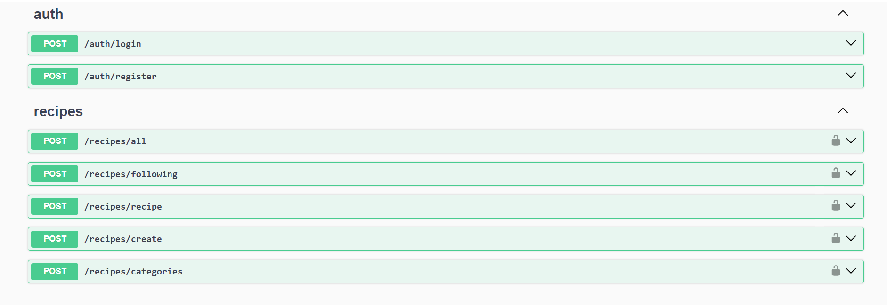

<h1>CookShare Backend🍔</h1>

This is the complete backend repository for CookShare

<h2>Features</h2>

<ul>
	<li><strong>Discover:</strong> Find new recipes shared from all over the world.</li>
	<li><strong>Rate &amp; Like :</strong> Show your appreciation by liking and rating your favorite recipes.</li>
	<li><strong>Upload Images:</strong> Capture and upload multiple images to showcase your favorite dishes and drinks.</li>
	<li><strong>Follow Friends:</strong> Stay updated with your friends&#39; latest recipes.</li>
	<li><strong>Save Finds:</strong> Bookmark recipes to try later.</li>
	<li><strong>Search:</strong> Easily find recipes using our intuitive search feature.</li>
</ul>

<h2>Technical Stack</h2>

<ul>
	<li><strong>Language:</strong> TypeScript</li>
	<li><strong>Framework:</strong> Nest.js</li>
	<li><strong>ORM:</strong> Prisma</li>
	<li><strong>Database:</strong> PostgreSQL</li>
</ul>

<h2>Todo</h2>

<ul>
  <li> Create API endpoints for recipe liking and saving functionalities.</li>
  <li>Integrate image upload functionality using AWS.</li>
  <li>Enhance search functionality with advanced filtering and sorting options.</li>
  <li>Optimize database queries and ensure scalability with Prisma ORM.</li>
</ul>

<h2>License</h2>

This project is licensed under the MIT License.

